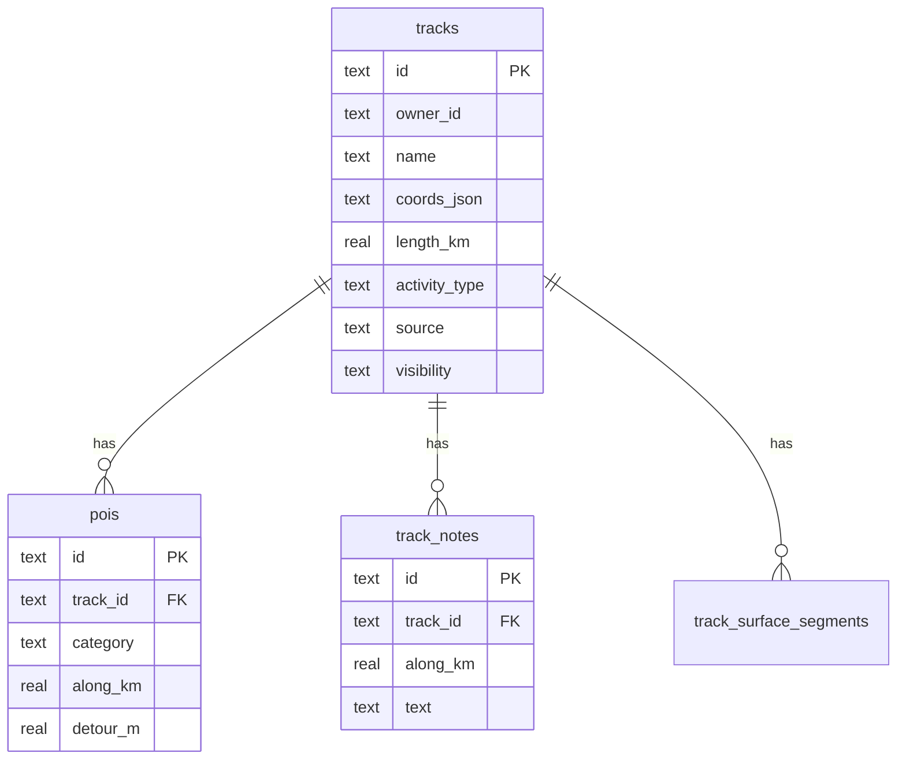

# Personal Map — Documentazione tecnica

## Architettura

| Layer | Tecnologia |
|-------|------------|
| Framework | Next.js 16.2 (App Router, `output: "standalone"`) |
| UI | React 19, Tailwind CSS v4 |
| Mappe | MapLibre GL 5, tile OSM + OpenTopoMap |
| Database | SQLite via `better-sqlite3`, WAL, `data/personal.db` |
| Auth | Session cookie, utenti fissi in `src/lib/auth.ts` |
| Geo pipeline | GPX parse → Douglas-Peucker → cumKm → Overpass snapshot |

```
GPX upload → track-ingest.ts → tracks (SQLite)
                    ↓
            run-track-snapshot.ts → pois + track_surface_segments
                    ↓
         /map (geojson overview)  /track/[id] (dettaglio)
```

## Modello dati



**Non presenti in v1:** checkpoints, race_plans, social graph, activities (recording GPS).

## Pipeline GPX

1. `parseGpxTrackpoints` (`gpx.ts`) — regex GPX 1.1
2. `simplifyLineStringWithIndices` — ε = 0.00005°
3. `cumulativeKmAlong` + D+/D− smoothed
4. Salva `coords_json`: `[lng, lat, elev|null, cumKm]`
5. Snapshot opzionale: griglia bbox → Overpass → `pois` + superficie OSM

## API contract

| Route | Metodo | Descrizione |
|-------|--------|-------------|
| `/api/auth/login` | POST | `{ username, password }` → cookie session |
| `/api/auth/logout` | POST | Invalida sessione |
| `/api/tracks` | GET | Lista tracce utente loggato |
| `/api/tracks/geojson` | GET | FeatureCollection overview |
| `/api/tracks/import` | POST | multipart `file` (.gpx), `name?`, `activityType?` |
| `/api/tracks/[id]/snapshot` | POST | POI + superficie (`webFast`) |
| `/api/tracks/[id]` | DELETE | Elimina traccia (solo owner) |
| `/api/tracks/credits` | GET | Crediti upload |
| `/api/track/[id]` | GET | Dettaglio traccia + coords |
| `/api/track/[id]/pois` | GET | POI filtrati (`categories`, `fromKm`, …) |

## Riuso da hmr-companion

| Copiato quasi invariato | Adattato |
|-------------------------|----------|
| `gpx.ts`, `track-geometry.ts`, `track-measure.ts` | `db.ts` (schema ridotto + `owner_id`) |
| `overpass.ts`, `snapshot-*.ts`, `surface-osm.ts` | `track-ingest.ts` (no seed HMR) |
| `ElevationChart.tsx`, `IngestProgressOverlay.tsx` | `MapView.tsx` (solo traccia + POI) |
| Pattern PWA `sw.js` | `PersonalApp.tsx`, `PersonalMapOverview.tsx` |

## Limitazioni

- Nessun PostGIS / MongoDB
- Tile raster OSM/OTM (rate limit tile server)
- Overpass pubblico: snapshot 5–15 min, `webFast` riduce griglia
- Auth a utenti fissi (non multi-tenant production-ready)
- `track_notes` in schema ma UI non ancora esposta

## Roadmap tecnica

| Fase | Feature | Base |
|------|---------|------|
| 2 | Recording GPS → tabella `activities` | Geolocation API + timestamped coords |
| 3 | Routing OSRM foot/bike | `trail-planner/src/lib/osrm-route.ts` |
| 4 | Share link read-only, export GPX | `visibility=link` + route pubblica |

## Deploy

Stesso pattern di `hmr-companion/deploy/`: Docker standalone + volume per `data/personal.db`.

Env utili:

- `PERSONAL_DB_PATH` — percorso DB
- `HMR_OVERPASS_*` / `PERSONAL_OVERPASS_UA` — tuning Overpass (eredita nomi companion in `overpass.ts`)
